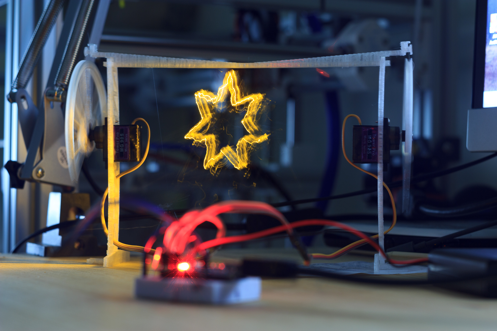

# 2D Lightpainting using Hobby Servos

A minimal lightpainting robot, using two servos driven by an Arduino mounted to
a 3D-printed scaffolding and moving an LED suspended by fishing line.

## Parts list and assembly

### Parts

  * Arduino nano or similar
  * A 5V power supply (3xAA batteries will do for 4.5V)
  * 2x `90S` micro servo (metal gear version preferred, e.g. `MG 90S`)
  * small breadboard and jumper wire
  * bright LED
  * fishing line (thin, flexible, strong, plastic thread)
  * thin wire to connect LED
  * small counterweight, such as a magnet or coin
  * Blue-Tack or similar to hold various things in place
  * 3D printed [parts](printed-parts/) (2x `gear`, 2x `foot`, 2x `stand`, 1x
    `beam`)

### Mechanical assembly

Clip the `foot` to the `stand`, and push in a servo so that the arm is outside,
as shown in the image above). Secure it with the top screw.

Repeat for the other side, then connect the two sides with the `beam`.

Fit a `gear` to each servo by removing the screw that holds the arm, clipping
the 3D printed part onto the arm, and securing it again with the screw.

You may need to take the arm off entirely to align it with the servo end
positions. The gear should be vertical at the end stops.

Cut two lengths of the fishing line to about 50cm. It can be shortened later!

Tie one end to the gear and secure with blue tack to ensure it goes into the
ridge when the gear turns.

Solder the thin wire to the LED and insulate with e.g. electrical tape.

Use Blue-Tack to hold together the LED and counterweight, and somehow connect it
to both fishing lines. When both sides are most extended, it should hover close
to the ground, horizontally centered in the frame.

_I haven't got a good solution for this part yet, I insulated the LED with
electrical tape, and sandwitched it with more Blue Tack and the fishing
lines between two small coins as counterweight._

### Electronics  

Make the connections on a breadboard using the jumper wires.

Servos:

* `brown` -> `GND` (if using a battery or external supplies, also connect its
  ground to the Arduino's `GND`)
* `red` -> `5V` (battery or external power supply recommended)
* `yellow` -> `D2` (left) and `D3` (right)

LED:

* `LED Anode` -> `D11`
* `LED Cathode` -> `GND`

Upload the [Arduino sketch](arduino/paint_2d/paint_2d.ino).

## Testing

Open a serial monitor (Arduino IDE) at `115200` baud. You should see a
`Hello World` message.

You can send GCODE commands on the serial connection, and this is also how the
more complex shapes will be drawn.

Write `M03` to turn the LED on, and `M05` to turn it off.

Try e.g. `G1 X20 Y20` to move to that position, and e.g. `G1 F600` to change the
feed rate (how fast the servos move).

## Drawing shapes

See [shapes/](shapes/star_0001.gcode) for an example SVG file and corresponding
GCode.

I used Inkscape to draw the shape (convert to path) and the JTech Photonics
Laser [plugin](https://jtechphotonics.com/?page_id=2012) to generate the GCODE.

Set the document unit to `mm` and the size to `120mm` width, `100mm` height.

[settings for laser plugin in inkscape](images/inkscape.png)

Copy and paste the generated GCODE into a serial terminal to draw the shape.
